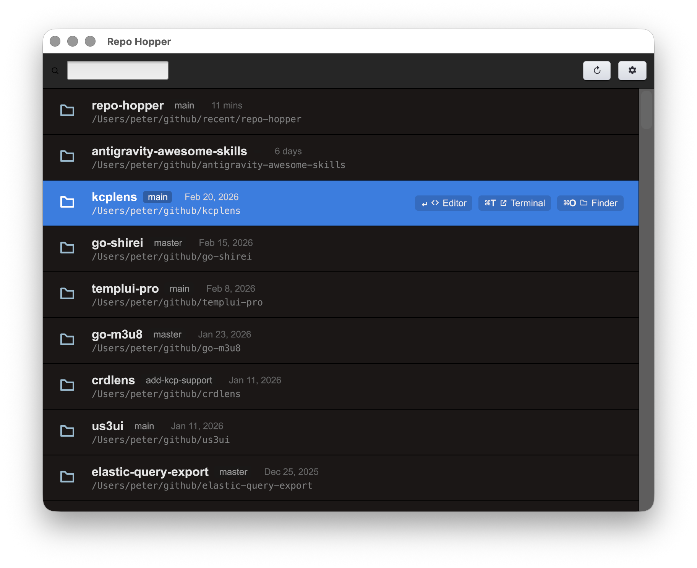

# 🐇 Repo Hopper

Are you juggling a dozen Git repositories at the same time? Do you constantly find yourself digging through Finder or typing long `cd` paths just to jump to the right project? **Repo Hopper** was built for that exact problem.

It's a fast, lightweight desktop launcher that keeps track of all your local Git repositories — and lets you jump to any of them in seconds. Think of it like Spotlight, but just for your repos.



---

## What it does

Repo Hopper scans your configured directories for Git repositories and presents them in a searchable list, sorted by the ones you touched most recently. From there, you can instantly open any repo in your editor, terminal, or Finder — all without touching the mouse.

**Key features:**
- 🔍 **Fuzzy search** — start typing a repo name or path and the list filters instantly
- ⏱️ **Recency-sorted** — the most recently changed repos float to the top
- ⌨️ **Keyboard-first** — navigate and open entirely without the mouse
- 🗂️ **Multi-directory scanning** — configure multiple root directories to scan
- 🪶 **Lightweight** — single binary, no Electron, no runtime, no nonsense

---

## Keyboard Shortcuts

| Key | Action |
|-----|--------|
| `↑` / `↓` | Navigate the repo list |
| `Enter` | Open selected repo in your configured editor |
| `⌘T` | Open selected repo in your terminal |
| `⌘O` | Open selected repo in Finder / file manager |
| `Esc` | Quit |

---

## Configuration

Repo Hopper reads its config from `~/.config/repo-hopper/settings.json`. Create it if it doesn't exist:

```json
{
  "scan_dirs": [
    "/Users/yourname/github",
    "/Users/yourname/projects"
  ],
  "editor": "code",
  "terminal": "iTerm"
}
```

| Field | Description | Default |
|-------|-------------|---------|
| `scan_dirs` | List of root directories to scan for Git repos | — |
| `editor` | CLI command for your editor (`code`, `goland`, `vim`, …) | `code` |
| `terminal` | Terminal app name (`Terminal`, `iTerm`, `Warp`, …) | `Terminal` |

---

## Installation

### Run directly (development)

```bash
make run
```

### Build a standalone binary

```bash
make build
./repo-hopper
```

### Build & install as a macOS .app

```bash
make deps    # installs the gogio bundler tool (one-time)
make install # builds RepoHopper.app and copies it to /Applications
```

> The `install` target also removes the macOS quarantine attribute and applies an ad-hoc code signature so the app runs without security prompts on your local machine.

---

## Platform support

Repo Hopper is written in Go and designed to be cross-platform — the GUI layer is built on [Gio](https://gioui.org/) / [Shirei](https://judi.systems/shirei/), which supports macOS, Linux, and Windows.

**Currently only tested on macOS.** Linux and Windows support is intended and the underlying OS actions (open terminal, open file manager, open editor) already have platform-specific implementations — but these paths haven't been verified yet. Contributions welcome!

---

## Tech stack

- **Go** — single binary, fast startup, easy cross-compilation
- **[Shirei](https://judi.systems/shirei/)** (built on [Gio](https://gioui.org/)) — immediate-mode GUI framework
- **[fuzzy](https://github.com/sahilm/fuzzy)** — high-performance fuzzy matching for the search bar
- Concurrent directory scanning via `filepath.WalkDir` + goroutines

---

## License

MIT
